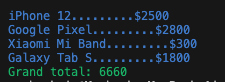
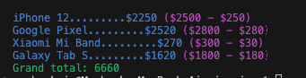

# Invoice app

## Requirements 
*Node.js 14 or above*

## Run project 
1. Install dependencies
```
npm install
```
2. Start project
```
npm run start
```

## Current output


## Problematic
As a cashier I want to see a more informative invoice detail 

Currently discounts are calculated as expected and applied to grand total, but is very difficult to provide more details to consumers due invoice is showing real prices instead the calculated one.

Now we need to see the calculated total and the detail of the discount, only if there is a discount to apply

Also we need to add a new discount 'cyber_monday' which applies a 30% of discount

## Expected result
